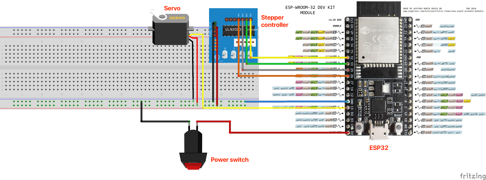

# CPSC 334 - Creative Embedded Systems

## Module 4 Task 2: Kinetic Sculpture

### Table of contents

- [CPSC 334 - Creative Embedded Systems](#cpsc-334---creative-embedded-systems)
  - [Module 4 Task 2: Kinetic Sculpture](#module-4-task-2-kinetic-sculpture)
    - [Table of contents](#table-of-contents)
      - [Video demo](#video-demo)
      - [Requirements](#requirements)
      - [Goals & vision](#goals--vision)
      - [Iteration](#iteration)
      - [Technical challenges](#technical-challenges)
      - [Schematic](#schematic)

#### Video demo

#### Requirements

- [x] You must use a minimum of (2* number of group members) motors and may use as many motors as you have available to your group
- [x] The device must have an enclosure or enclosures
- [x] The device must be safe to operate over long periods of time. For instance, if you have continuous motion, you should **provide a switch** that allows a user to switch off the actuators
- [x] The device utilizes actuators
- [x] Reuses previous sensors, **config code**, **design principles**

#### Goals & vision

#### Iteration

#### Technical challenges

- Quality of Moire effect
  - Small slits
  - Low light
  - Type of animation
- ESP32 support of multiple steppers

#### Schematic

